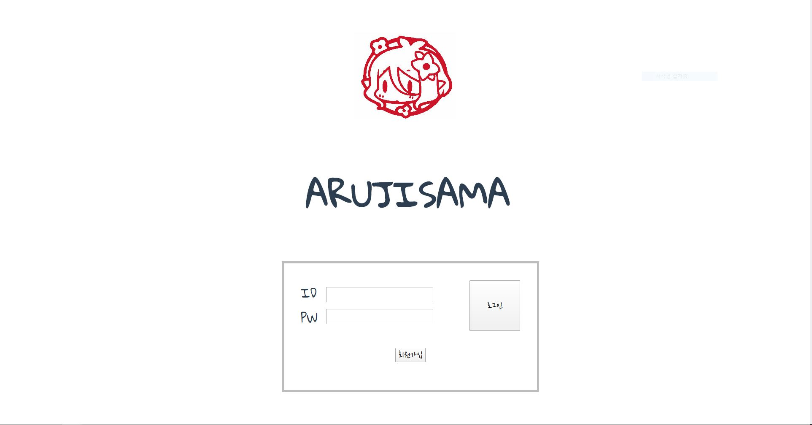
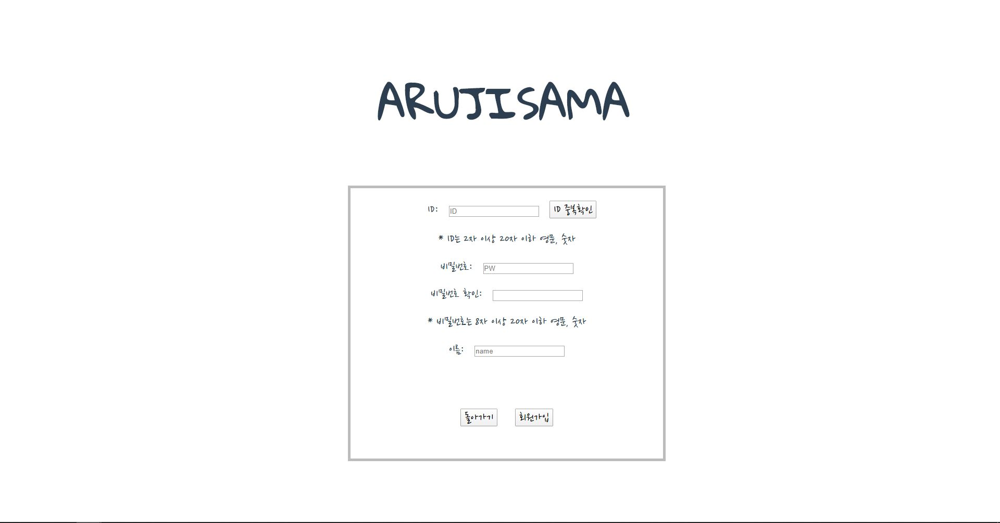
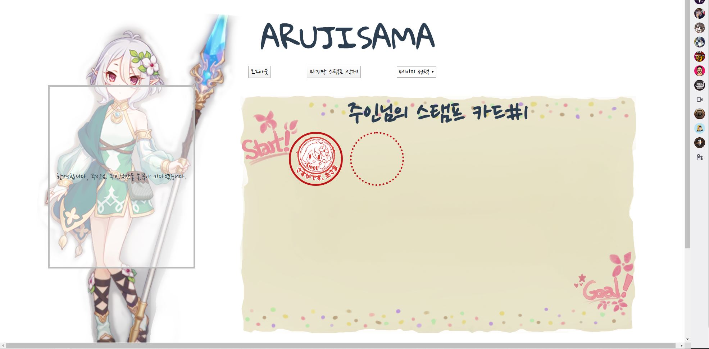

# ARUJISAMA
 **ARUJISAMA** 프로젝트에 온 것을 환경합니다, 주인님.
## 프로젝트 소개
 **ARUJISAMA**는 하루를 정리하는 주인님을 위한 콧코로의 **데일리 메모 웹 서비스**입니다.
 
  * **개발환경**
    * python 3.7
    * node.js
    * MySQL
    
  * **사용하는 프레임워크**
    * Flask (Python)
    * Vue.js (JavaScript)
    * axios (JavaScript)
    * SQLAlchemy_Flask (DB)
    
## 프로젝트 시작하기
  
  1. 레포를 다운받아주세요.
  
  2. 터미널의 **_arujisama/arujisama_flask_** 디렉토리에서 `pip install -r requirements.txt`를 실행하여  
  프로젝트에 사용한 라이브러리들을 인스톨합니다.
  
  3. **_arujisama/web_** 디렉토리에서 `npm install` 을 실행하여  
  프로젝트에서 사용된 JavaScript Dependency들을 인스톨합니다.
  
  4. 프로젝트에 사용할 MySQL Server Connection을 준비해주세요.
  
  5. **_arujisama/arujisama_flask/app/config_files_** 디렉토리에  
  `dbinfo.json`과 `secret_key.json`파일을 다음의 내용으로 추가해주세요.
  
  * **_dbinfo.json_**
  ```{.json}
  {
   "HOST" : "127.0.0.1",
   "PORT" : "PORT_NUMBER_YOU_WANT",
   "USER" : "YOUR_MYSQL_CONNECTION_USER",
   "PWD" : "YOUR_MYSQL_CONNECTION_PASSWORD",
   "NAME" : "YOUR_MYSQL_CONNECTION_NAME"
  }
   ```
   * **_secret_key.json_**
   ```{.json}
   {
      "secret_key": "WHATEVER_YOU_WANT"
  }
  ```
  
  6. DB Migration을 다음과 같이 진행해주세요.
  ```
  python arujisama/arujisama_flask/db_migration.py db init
  python arujisama/arujisama_flask/db_migration.py db migrate
  python arujisama/arujisama_flask/db_migration.py db upgrade
  ```
  
  7. **_arujisama/web_** 디렉토리에서 `npm run build` 를 실행하여 웹을 빌드합니다.
  
  8. **_arujisama/arujisama_flask/run.py_** 를 실행하면  
  [ARUJISAMA](http://127.0.0.1:3781) 에 접속하실 수 있습니다! 회원가입을 하고 스탬프를 찍어보세요!
  
  
## 로그인 페이지
주인님께서 처음으로 보실 화면입니다.


## 회원가입 페이지
Arujisama가 처음이신 주인님께 필요한 화면입니다.


## 메인 스탬프 페이지

점선 칸을 클릭해 새로운 스탬프를 찍어보세요!

